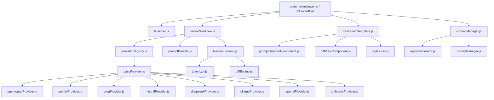

# 🧑‍🏫 Code Documentation: Amplenote Grammar & Style Reviewer

## 1. Architecture Overview

The **Grammar & Style Reviewer** is built with a modular, decoupled architecture adhering to ESM patterns, local session persistence, and zero-latency client-side view management.

---

## 2. Core Modules

### `lib/engine/`
- **`reviewSession.js`**: State container managing the active document, tokenized items, current index, accepted/rejected states, metrics, and JSON serialization (`toJSON()` / `fromJSON()`) for `localStorage` persistence.
- **`tokenizer.js`**: Breaks Markdown text into inspectable units (`full`, `paragraph`, `sentence`) while preserving empty lines, markdown code fences, headers, and bullet structures.
- **`diffEngine.js`**: Calculates word-level diffs, generating insertion (`<ins>`) and deletion (`<del>`) HTML spans with safety escaping.
- **`promptPresets.js`**: Pre-configured system and user prompts for tone, conciseness, flow, humor, and grammar corrections.

### `lib/providers/`
- **`baseProvider.js`**: Abstract base class enforcing standard `complete({ prompt, systemPrompt, model })` signature.
- **`providerRegistry.js`**: Factory instantiating adapters for **OpenRouter, Gemini, Groq, Mistral, DeepSeek, Ollama, OpenAI, and Anthropic**. Provides configuration extraction and key validation.

### `lib/ui/`
- **`dashboardTemplate.js`**: Renders the complete HTML shell with embedded client-side routing (`Reviewer`, `History Logs`, `Settings`), keyboard shortcuts, dynamic theme switcher, and masked API key controls.
- **`styles.css.js`**: High-performance CSS engine providing 6 complete themes (`midnight`, `nord`, `glass`, `emerald`, `purple`, `light`), fluid scrollbars, sticky navigation headers, and responsive diff panes.
- **`promptSelectorComponent.js`**: Granularity dropdown, prompt preset chips, and provider status indicators.
- **`diffViewComponent.js`**: Dual-pane side-by-side original vs AI suggestion diff with inline manual editing.

### `lib/data/`
- **`store.js`**: In-memory active session reference.
- **`reportGenerator.js`**: Generates human-readable markdown reports for `-reports/-grammar/-changes`.
- **`historyManager.js`**: Formats and parses machine-readable JSON history logs tagged `-reports/-grammar/-history`.

---

## 3. Communication & State Flow

1. **Host Bridge**: All embed user interactions invoke Amplenote's official `window.callAmplenotePlugin(action, ...args)` bridge.
2. **Passive vs Active Dispatch**:
   - Passive actions (`setTheme`, `setTab`, `selectProviderCard`) execute entirely inside the client DOM in **0ms** without host reloads.
   - Active mutations (`runReview`, `saveAndCommit`, `setGranularity`, `selectNote`) invoke `onEmbedCall(app, ...args)` and cleanly update the view state.
3. **Session Persistence**: Sessions automatically synchronize to client `localStorage` under `ANP_GRAMMAR_REVIEWER_SESSION_STATE` and restore smoothly if the embed is reopened.

---

## 4. Test Suite

- [`test/tokenizer.test.js`](file:///c:/Users/ADMIN/OneDrive/Documents/GitHub/amplenote_stg_plugins/anp-23-grammar-reviewer/test/tokenizer.test.js): Tokenization across full, paragraph, and sentence modes.
- [`test/diffEngine.test.js`](file:///c:/Users/ADMIN/OneDrive/Documents/GitHub/amplenote_stg_plugins/anp-23-grammar-reviewer/test/diffEngine.test.js): Word-level diff accuracy, whitespace normalization, and HTML escaping.
- [`test/reportGenerator.test.js`](file:///c:/Users/ADMIN/OneDrive/Documents/GitHub/amplenote_stg_plugins/anp-23-grammar-reviewer/test/reportGenerator.test.js): Report formatting and session serialization.
- [`test/providers.test.js`](file:///c:/Users/ADMIN/OneDrive/Documents/GitHub/amplenote_stg_plugins/anp-23-grammar-reviewer/test/providers.test.js): Mock fetch validation across all 8 provider adapters.
- [`test/liveProviderTester.js`](file:///c:/Users/ADMIN/OneDrive/Documents/GitHub/amplenote_stg_plugins/anp-23-grammar-reviewer/test/liveProviderTester.js): Standalone simulated and live provider diagnostic runner.
