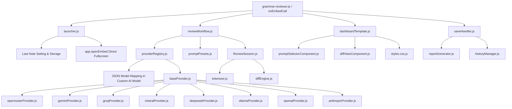

# 🧑‍🏫 Code Documentation: Amplenote Grammar & Style Reviewer

## 1. Architecture Overview

The **Grammar & Style Reviewer** is built with a modular, decoupled architecture adhering to ESM patterns, local session persistence, and zero-latency client-side view management.

---

## 2. Core Modules

### `lib/engine/`
- **`reviewSession.js`**: State container managing the active document, tokenized items, current index, accepted/rejected states, metrics, and JSON serialization (`toJSON()` / `fromJSON()`) for `localStorage` persistence. Defaults to `Full Note` mode.
- **`tokenizer.js`**: Breaks Markdown text into inspectable units (`full`, `paragraph`, `sentence`) while preserving empty lines, markdown code fences, headers, and bullet structures.
- **`diffEngine.js`**: Fine-grained sub-word and punctuation LCS/Myers diff algorithm generating `originalHtml` (deletions in red), `suggestedHtml` (clean readable prose with green insertions), and `inlineHtml` (interleaved diff).
- **`promptPresets.js`**: Pre-configured system and user prompts for tone, conciseness, flow, humor, and grammar corrections.

### `lib/features/`
- **`launcher.js`**: Direct 1-click fullscreen launcher that automatically resolves and remembers the `Last Opened Note UUID` across sessions.
- **`reviewWorkflow.js`**: AI completion runner with isolated endpoint routing for cloud vs Ollama providers.
- **`saveHandler.js`**: Overwrites source note directly and optionally generates human-readable changes reports and JSON history notes when audit logging is enabled.
- **`historyViewer.js`**: Multi-query history fetcher querying and deduplicating past review sessions.

### `lib/providers/`
- **`baseProvider.js`**: Abstract base class enforcing standard `complete({ prompt, systemPrompt, model })` signature with localhost/CORS error extraction.
- **`providerRegistry.js`**: Factory instantiating adapters for **OpenRouter, Gemini, Groq, Mistral, DeepSeek, Ollama, OpenAI, and Anthropic**. Extracts per-provider keys and model maps (JSON dictionary) without requiring extra setting rows.

### `lib/ui/`
- **`dashboardTemplate.js`**: Renders the complete HTML shell with embedded client-side routing (`Reviewer`, `History Logs`, `Settings`), keyboard shortcuts, dynamic theme switcher, Amplenote Revision History legend, and synchronized dual-pane scroll locks.
- **`styles.css.js`**: High-performance CSS engine providing a 100% full-width 2-column workbench layout (`.gr-workbench`), 6 complete themes (`midnight`, `nord`, `glass`, `emerald`, `purple`, `light`), fluid scrollbars, and side-by-side diff highlights.
- **`promptSelectorComponent.js`**: Left sidebar control panel rendering active AI engine & model badge/dropdown (filtered to saved providers), granularity segmented pills, prompt presets list, and live progress metrics.
- **`diffViewComponent.js`**: Dual-pane side-by-side original vs clean AI suggestion diff with 0ms view toggle pills (`✨ Clean Prose` vs `🔀 Inline Diff`).

---

## 3. Communication & State Flow

1. **Host Bridge**: All embed user interactions invoke Amplenote's official `window.callAmplenotePlugin(action, ...args)` bridge.
2. **Side-by-Side Clean Diffing**:
   - Left pane highlights deleted text (``) in the original draft.
   - Right pane renders clean, readable prose with inserted words highlighted in emerald green (``).
3. **Optional Audit Logging (Off by Default)**:
   - Amplenote natively captures note version history every 10 minutes. By default, reviews save directly into the active note without creating extra note files unless explicitly enabled in settings.
4. **Per-Provider Model Persistence**:
   - `app.settings["Custom AI Model"]` stores a clean JSON dictionary `{ [provider]: model }` allowing independent model memory per provider without modifying the note settings table schema.

---

## 4. Test Suite

- [`test/tokenizer.test.js`](file:///c:/Users/ADMIN/OneDrive/Documents/GitHub/amplenote_stg_plugins/anp-23-grammar-reviewer/test/tokenizer.test.js): Tokenization across full, paragraph, and sentence modes.
- [`test/diffEngine.test.js`](file:///c:/Users/ADMIN/OneDrive/Documents/GitHub/amplenote_stg_plugins/anp-23-grammar-reviewer/test/diffEngine.test.js): Word-level diff accuracy, whitespace normalization, and HTML escaping.
- [`test/reportGenerator.test.js`](file:///c:/Users/ADMIN/OneDrive/Documents/GitHub/amplenote_stg_plugins/anp-23-grammar-reviewer/test/reportGenerator.test.js): Report formatting and session serialization.
- [`test/providers.test.js`](file:///c:/Users/ADMIN/OneDrive/Documents/GitHub/amplenote_stg_plugins/anp-23-grammar-reviewer/test/providers.test.js): Mock fetch validation across all 8 provider adapters.
- [`test/liveProviderTester.js`](file:///c:/Users/ADMIN/OneDrive/Documents/GitHub/amplenote_stg_plugins/anp-23-grammar-reviewer/test/liveProviderTester.js): Standalone simulated and live provider diagnostic runner.
