# 🧑‍🏫 Code Documentation: Amplenote Grammar & Style Reviewer

## 1. Architecture Overview

The **Grammar & Style Reviewer** is built with a modular, decoupled architecture adhering to ESM patterns, local session persistence, reversible state machines, and zero-latency client-side view management.

```mermaid
graph TD
    Entry[grammar-reviewer.js / onEmbedCall] --> Launcher[launcher.js]
    Entry --> ReviewWorkflow[reviewWorkflow.js]
    Entry --> CommitManager[saveHandler.js]
    
    Launcher --> NoteMemory[Last Note Setting & Storage]
    Launcher --> DirectEmbed[app.openEmbed Direct Fullscreen]
    
    ReviewWorkflow --> Session[ReviewSession.js]
    ReviewWorkflow --> PromptPresets[promptPresets.js]
    ReviewWorkflow --> ProviderRegistry[providerRegistry.js]
    ReviewWorkflow --> UsageTracker[usageTracker.js]
    
    ProviderRegistry --> PerProviderModelMap[JSON Model Mapping in Custom AI Model]
    ProviderRegistry --> BaseProvider[baseProvider.js]
    BaseProvider --> OpenRouter[openrouterProvider.js]
    BaseProvider --> Gemini[geminiProvider.js]
    BaseProvider --> Groq[groqProvider.js]
    BaseProvider --> Mistral[mistralProvider.js]
    BaseProvider --> DeepSeek[deepseekProvider.js]
    BaseProvider --> Ollama[ollamaProvider.js]
    BaseProvider --> OpenAI[openaiProvider.js]
    BaseProvider --> Anthropic[anthropicProvider.js]
    
    Session --> Tokenizer[tokenizer.js]
    Session --> DiffEngine[diffEngine.js]
    Session --> UndoStack[Undo / History Stack]
    
    Entry --> Dashboard[dashboardTemplate.js]
    Dashboard --> TopLoader[Top Progress Loader & Op Banner]
    Dashboard --> SidebarPanel[promptSelectorComponent.js]
    Dashboard --> DiffCard[diffViewComponent.js]
    Dashboard --> UsageSection[AI Usage & Provider Breakdown Details]
    DiffCard --> ReviewNavigator[Review Navigator & Jump Dropdown]
    DiffCard --> DiffModes[4 Diff Modes: Clean / Inline / Side / Changes]
    DiffCard --> TeacherInsight[Teacher Insight Rationale Box]
    Dashboard --> Styles[styles.css.js]
    
    CommitManager --> StaleGuard[Stale Note Concurrency Check]
    CommitManager --> ReportGen[reportGenerator.js]
    CommitManager --> HistoryMgr[historyManager.js]
```

---

## 2. Core Modules

### `lib/engine/`
- **`reviewSession.js`**: State container managing the active document, tokenized items, current index, accepted/rejected/modified states, assigned note tags, metrics, and JSON serialization (`toJSON()` / `fromJSON()`) for `localStorage` persistence.
  - **Undo Stack**: Maintains a bounded snapshot stack (`pushUndo`, `undo`, `canUndo`) on each item for reversible decisions.
  - **Paragraph-Preserving Sentence Reconstruction**: `getReconstructedContent()` preserves multi-line markdown structures and joins intra-paragraph sentences with spaces rather than extra newlines.
  - **Note Tags Tracking**: Persists `noteTags` string array retrieved from the note.
  - **Pending Navigation Helpers**: `getNextPendingIndex()` and `getPrevPendingIndex()` to skip reviewed chunks.
- **`tokenizer.js`**: Breaks Markdown text into inspectable units (`full`, `paragraph`, `sentence`) while preserving empty lines, markdown code fences, headers, and bullet structures.
  - **Parent Paragraph Tracking**: Annotates sentences with `parentParagraphId` and `isLastInParagraph` for reconstructive integrity.
  - **Expanded Abbreviation Protections**: 40+ honorifics (`Dr.`, `Prof.`), titles (`Inc.`, `Ltd.`), time units (`min.`, `sec.`), decimals (`3.14`), and URLs to prevent improper sentence fragmentation.
- **`diffEngine.js`**: Fine-grained sub-word and punctuation LCS/Myers diff algorithm with common prefix/suffix optimization.
  - **4 Diff Modes**: Produces `suggestedHtml` (Clean Prose), `inlineHtml` (Unified Diff), `originalHtml` (Side-by-Side), and `changesHtml` (Changes Only list).
  - **`extractChangesList(diff)`**: Extracts structured change objects (`{ type, original, suggested }`) for the Changes Only card view.
- **`promptPresets.js`**: Pre-configured system and user prompts for tone, conciseness, flow, humor, minimal changes, and teacher/coach modes.

### `lib/data/`
- **`usageTracker.js`**: Amplenote-persisted AI quota and telemetry accounting module.
  - **Setting Key**: `AI Usage Stats` (stores clean JSON dictionary in plugin settings via `app.setSetting`).
  - **Functions**: `getTodayDateString()`, `getDefaultUsageStats()`, `getUsageStats(app)`, `recordUsage(app, provider, isSuccess)`, and `resetUsage(app, mode)`.
  - **Automatic Daily Rollover**: Automatically resets all `today` counters to `0` at midnight (`00:00`) when the date changes, while preserving `lifetime` counts.
  - **Provider-Wise Metrics**: Tracks success vs. failure counts for every supported provider.
- **`store.js`**: Active memory session holder (`getActiveSession`, `setActiveSession`, `clearActiveSession`).
- **`reportGenerator.js`**: Generates human-readable Markdown changes reports and session snapshots.
- **`historyManager.js`**: Creates and queries structured JSON history notes tagged with `-reports/-grammar/-history`.

### `lib/features/`
- **`launcher.js`**: Direct 1-click fullscreen launcher that handles both note-specific reviews (`noteOption`) and cross-note dashboard opening (`appOption`), automatically navigating to the fullscreen plugin view (`https://www.amplenote.com/notes/plugins/${pluginUUID}`) while preserving clean empty-state fallback when no note is active.
- **`reviewWorkflow.js`**: AI completion runner with cancellation support (`cancelReviewAll`), transient item reviewing states, and re-review prompt overrides.
- **`saveHandler.js`**: Overwrites source note directly with note UUID validation and error handling; includes a concurrency guard that checks `app.getNoteContent()` to prevent overwriting stale externally modified notes. Optionally generates companion audit notes.
- **`historyViewer.js`**: Multi-query history fetcher querying and deduplicating past review sessions.

### `lib/providers/`
- **`baseProvider.js`**: Abstract base class enforcing standard `complete({ prompt, systemPrompt, model })` signature with localhost/CORS error extraction and timeout controls.
- **`providerRegistry.js`**: Factory instantiating adapters for **OpenRouter, Gemini, Groq, Mistral, DeepSeek, Ollama, OpenAI, and Anthropic**. Extracts per-provider keys and model maps (JSON dictionary) via safe, resilient parsing without requiring extra setting rows.

### `lib/ui/`
- **`dashboardTemplate.js`**: Renders the complete HTML shell with embedded client-side routing (`Reviewer`, `History Logs`, `Settings`), top operation loader bar (`.gr-top-loader`), live operation banner, note tag pills, keyboard shortcuts (`A`, `R`, `U`, `N`/`P`, `T`), 12-theme dynamic cycler, and synchronized dual-pane scroll locks.
  - **In-DOM Modal Dialog Architecture**: Replaces browser-native `prompt()` and `confirm()` with sandboxed-safe in-DOM dialog components (`showAppPrompt`, `showAppConfirm`, `showAppChoice`, `closeAppModal`) to eliminate iframe dead clicks.
- **`diffViewComponent.js`**:
  - **Review Navigator**: Jump-to item dropdown with status badges (`✓`, `✕`, `✎`, `●`, `○`) and pending navigation buttons.
  - **4 Diff View Modes**: Segmented toggle buttons (`✨ Clean Prose`, `🔀 Inline Diff`, `👥 Side-by-Side`, `📋 Changes Only`).
  - **Teacher's Insight Box**: Explanations, category tags (Grammar, Clarity, Word Choice), and confidence indicators.
  - **State-Aware Action Buttons**: Contextual button groups per state (`pending`, `suggestion_ready`, `accepted`, `rejected`, `modified`) with reversible `↩ Undo`.
- **`promptSelectorComponent.js`**: Left sidebar control panel rendering active AI engine & model dropdown (filtered to saved providers), granularity segmented pills, categorized prompt style dropdown with `<optgroup>`s and description badge, pending count badge (`⚡ All Pending (N)`), and live progress metrics.
- **`styles.css.js`**: High-performance CSS engine providing a 100% full-width 2-column workbench layout (`.gr-workbench`), 12 complete themes (5 light, 7 dark), in-DOM modal overlay animations, fluid scrollbars, and diff highlights.

---

## 3. Communication & State Flow

1. **Host Bridge**: All embed user interactions invoke Amplenote's official `window.callAmplenotePlugin(action, ...args)` bridge.
2. **Reversible Decision State Transitions**:
   - `pending` ➔ `suggestion_ready` (via `runReview` or `reviewAll`)
   - `suggestion_ready` ➔ `accepted` (via `acceptItem` / `A`)
   - `suggestion_ready` ➔ `rejected` (via `rejectItem` / `R`)
   - Any state ➔ `modified` (via `manualEditItem`)
   - `accepted` / `rejected` / `modified` ➔ prior state (via `undoItem` / `U`)
3. **4 Diff View Modes (0ms Switching)**:
   - `setDiffViewMode(index, mode)` switches between Clean Prose, Inline Diff, Side-by-Side, and Changes Only entirely in client JS using pre-encoded DOM data attributes.
4. **Sandboxed-Safe In-DOM Modal Subsystem**:
   - Amplenote sandboxed iframe embeds block native `window.prompt()` and `window.confirm()`. All user prompts (Custom Prompts, Manual Edits, Re-Review Reasons, Reset Confirmations, Key Deletions) execute via a responsive in-DOM modal dialog overlay (`.gr-modal-backdrop`).
5. **Stale Note Concurrency Protection**:
   - Prior to committing, `saveHandler.js` verifies if the target note's current content matches the session baseline. If external changes are detected, an in-DOM confirmation prompt prevents unintentional overwrites.
6. **Per-Provider Model Persistence**:
   - `app.settings["Custom AI Model"]` stores a clean JSON dictionary `{ [provider]: model }` allowing independent model memory per provider without modifying the note settings table schema.
7. **Zero-Flicker Client-Side Configuration Updates**:
   - Left sidebar controls (`setProvider`, `setModel`, `setPreset`, `setCustomPrompt`, `clearCustomPrompt`) execute in-DOM UI state updates instantaneously with 0ms latency and notify the host in the background with `requiresReRender = false`, preventing unnecessary iframe rebuilds and eliminating screen flashing.
8. **Targeted In-Place Canvas & Progress DOM Swapping**:
   - Review runs, accept/reject, undo, and item navigation update `#main-canvas-container` and `#sidebar-progress-container` directly in-place, keeping sidebar inputs and dropdowns permanently mounted without destruction. Floating toast indicator (`.gr-op-banner`) displays operation progress without layout shifting.
9. **Live API Key Detection & Interactive Health Check Validation**:
   - Provider cards display a dynamic status dot (`🟢` configured, `⚪` missing) updating in real time as keys are entered or deleted.
   - The `[⚡ Test API]` / `[⚡ Test Ollama]` action executes `testProviderConnection`, dispatching a lightweight completion ping to measure round-trip latency, verify API credentials, and render a `⚡ Validated (${latency}ms)` badge directly on the provider card.

---

## 4. Test Suite

The test suite runs with Jest under Node ESM VM modules (`$env:NODE_OPTIONS="--experimental-vm-modules"; npx jest anp-23-grammar-reviewer/test`):

- [`test/usageTracker.test.js`](test/usageTracker.test.js): Provider initialization, settings persistence, daily rollover at midnight, and reset operations (mode='today' vs mode='all').
- [`test/tokenizer.test.js`](test/tokenizer.test.js): Tokenization across full, paragraph, and sentence modes, parent paragraph tracking, and abbreviation protections.
- [`test/diffEngine.test.js`](test/diffEngine.test.js): Word-level diff accuracy, 4 diff modes, changesList extraction, whitespace normalization, and HTML escaping.
- [`test/reviewSession.test.js`](test/reviewSession.test.js): Paragraph-preserving sentence reconstruction, undo stack, metrics calculation, and serialization.
- [`test/diffViewComponent.test.js`](test/diffViewComponent.test.js): State-aware action buttons, 4 view modes, Teacher's Insight, and Review Navigator rendering.
- [`test/saveHandler.test.js`](test/saveHandler.test.js): Source note overwrite, stale guard validation, and optional audit report creation.
- [`test/reportGenerator.test.js`](test/reportGenerator.test.js): Markdown report formatting, safe dynamic code fence escaping, and metadata headers.
- [`test/historyManager.test.js`](test/historyManager.test.js): History record persistence, safe JSON code fence embedding, and JSON format verification.
- [`test/providers.test.js`](test/providers.test.js): Mock fetch validation across all 8 provider adapters.
- [`test/providerRegistry.test.js`](test/providerRegistry.test.js): Configuration parsing, key masking, provider instantiation, and diagnostic API health ping simulation.
- [`test/promptPresets.test.js`](test/promptPresets.test.js): System and user prompt construction, structured JSON response parser (`parseAiResponse`), and plain-text fallback handling.
- [`test/scenarioWorkflow.test.js`](test/scenarioWorkflow.test.js): End-to-end integration and workflow scenario tests (Scenarios A–G covering sentence preservation, markdown structure preservation, partial failure resilience, mid-stream cancellation, stale overwrite protection, granularity switching, and manual edit state flows).

