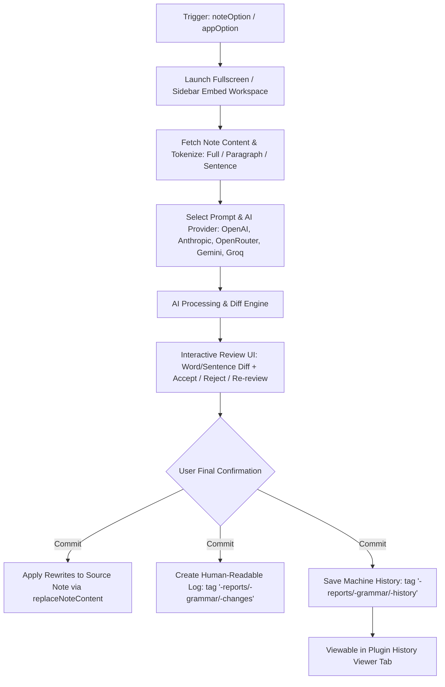

## [🧑‍🏫 Progressively review grammar suggestions](https://www.amplenote.com/bounty_plugins#----Progressively-review-grammar-suggestions)

Implement a plugin that can check a note for grammar or structure improvements, and suggest those improvements to the user as they traverse through the note.

Some types of suggestions that this plugin could ask AI to look for include:

- Could be shortened
- Could have grammar improved
- Example could be added
- Humor could be added
- Adverbs could be omitted
- Could remove passive voice
- and many more options...

And other common writing suggestions that would be given by a high school language teacher.

---

[https://amplenoteplugins.featureupvote.com/suggestions/446559/allow-individually-reviewing-each-ai-grammar-improvement-suggestion](https://amplenoteplugins.featureupvote.com/suggestions/446559/allow-individually-reviewing-each-ai-grammar-improvement-suggestion) 

Currently it's possible to get OpenAI to submit a completely rewritten version of a note, but it's not possible to incrementally evaluate each of the changes that OpenAI would suggest.

It would be much more useful if a plugin were implemented such that:

1. It makes the same call to OpenAI as the default AI plugin, to retrieve a rewritten note in full
1. Diff the received text with the existing note text to produce an array of strings from the original note that changed.
1. Iterate over each of these change locations. For the visited change, use \`replaceContent\` to replace the existing phrase with a highlighted version of itself, so the user knows which phrase they are considering replacing. Then trigger a popup input dialog asking the user if they want to change the highlighted phrase into the OpenAI suggestion to replace it
1. For each replacement prompt, allow the user to skip/approve the recco, or cancel the replacement iteration loop

---

- The above steps or options were suggested and written 3 years ago.
- When focusing on current development and advancement in AI and Coding, we can do better.
- Plan:
    - Have a list of Free/Paid and Paid Options. - Of AI API Providers. 
        - (Build in such a way it can be reused in other projects, and make a note in common-issues-and-fixes - ai-providers.md)
        - In settings page, how to get API and link of various Free/Paid and Paid Options. (should be saved to amplenote settings)
    - Should open in Full Screen Page - similar to habit streak or graph utility.
    - Option to review Full or Paragraph or Sentence by Sentence.
        - Accept or Reject or Re-Review Again.
    - Prompt to AI should be customizable. Options for User Input Prompt as well. Options for Pre-Build Standard Prompts as well.
    - User should get Options to Save
        - Rewrite the whole Note with AI Reviewed Note Content. (User should be able to View the final content before saving).
        - default should also save
            - A separate Human Readable markdown note - with various Iterations that went through - like Initial Content, First Iteration, Second Iteration as Headers and its content below it with some meaningful content like time, ai used, prompt used and other additional detail which may seem useful. And this note should have a link to the the main note which was considered for AI Grammar Review. note tag: "-reports/-grammar/-changes" note name: "timestamp Unix"
            - A separate History page should get saved, which can be read only through the plugin - A separate View Option. note tag: "-reports/-grammar/-history" note name: "timestamp Unix"
                - (It should contain All Multiple Iteration, Time, AI Used, Prompt Used, and other additional data which ever will be useful and meaningful when returning after a particular point of time)

---

## Amplenote Grammar Review Plugin — High-Level Implementation Plan

**1. AI Provider Layer**
- Build a reusable provider abstraction (Free + Paid APIs: OpenAI, Anthropic, OpenRouter, etc.)
- Settings page: API key input + provider docs links, saved to Amplenote plugin settings
- Document pattern in `common-issues-and-fixes/ai-providers.md` for reuse across plugins

**2. UI Shell**
- Full-screen plugin page (same pattern as habit streak/graph utilities)
- Review granularity toggle: Full Note / Paragraph / Sentence
- Per-item controls: Accept / Reject / Re-review

**3. Prompt System**
- Pre-built standard prompts (grammar, shorten, remove passive voice, add humor, etc.)
- Custom user-prompt input option
- Prompt selection stored per session

**4. Review Flow**
- Send note (or chunk) to selected AI provider
- Diff original vs AI output → generate change list
- Walk user through each change with highlight + accept/reject/re-review loop (using `replaceContent`)

**5. Save Options**
- **Primary save:** rewrite note with AI-reviewed content, with a preview step before committing
- **Auto-generated logs (always saved):**
  - Human-readable iteration note (Initial → Iteration 1 → Iteration 2…, with timestamp/AI used/prompt used), linked back to source note
    - Tag: `-reports/-grammar/-changes`, Name: Unix timestamp
  - Machine/read-only history note (full iteration + metadata log), viewable only via plugin
    - Tag: `-reports/-grammar/-history`, Name: Unix timestamp

**6. Build Order (suggested)**
1. Provider abstraction + settings
2. Full-screen page shell
3. Diff + accept/reject loop (paragraph-level first, sentence later)
4. Prompt customization
5. Save-to-note logic (main rewrite)
6. Changes note + history note generation
7. Polish: granularity switch, re-review, provider switching

---

## Detailed Implementation Plan & Architecture

### System Flow


---

### Architecture & Directory Layout

Following the modular repository standard:

```
anp-23-grammar-reviewer/
├── grammar-reviewer.js                 # Amplenote plugin entry point (noteOption, appOption, renderEmbed, onEmbedCall)
├── ds.md                               # Specification & requirements
├── README.md                           # Documentation & quick start guide
├── CODE_DOCUMENTATION.md               # Technical architecture & API reference
├── DESIGN_PHILOSOPHY.md                # UX & design decisions
├── lib/
│   ├── constants.js                    # Prompts, model endpoints, tags (-reports/-grammar/...)
│   ├── providers/                      # Reusable AI Provider Layer
│   │   ├── baseProvider.js             # Common fetch, retry & streaming/JSON interface
│   │   ├── openaiProvider.js           # OpenAI (GPT-4o, GPT-4o-mini)
│   │   ├── anthropicProvider.js        # Anthropic (Claude 3.5 Sonnet, Claude 3 Haiku)
│   │   ├── openrouterProvider.js       # OpenRouter (Free & Paid models: Llama 3, DeepSeek, Mistral)
│   │   ├── geminiProvider.js           # Google Gemini (Gemini 1.5 Flash/Pro, Gemini 2.0)
│   │   ├── groqProvider.js             # Groq (Ultra-fast inference)
│   │   └── providerRegistry.js         # Provider discovery, key validation & dispatcher
│   ├── engine/                         # Core Logic & Algorithms
│   │   ├── tokenizer.js                # Note chunker (Full Note, Paragraph, Sentence with markdown safety)
│   │   ├── diffEngine.js               # Word-level & char-level diffing (additions, deletions, edits)
│   │   ├── promptPresets.js            # Standard prompts (Grammar, Conciseness, Passive Voice, Tone, Humor)
│   │   └── reviewSession.js            # Session state, iteration tracking & undo/redo stack
│   ├── data/                           # Persistence & Amplenote Note Storage
│   │   ├── store.js                    # Local session caching & active state
│   │   ├── reportGenerator.js          # Formats human-readable markdown reports (-reports/-grammar/-changes)
│   │   └── historyManager.js           # Structured history persistence & retrieval (-reports/-grammar/-history)
│   ├── features/                       # Action Handlers for onEmbedCall
│   │   ├── launcher.js                 # Embed opener (Fullscreen Tab vs Sidebar Peek)
│   │   ├── reviewWorkflow.js           # Step-by-step traversal, accept/reject, re-review chunk
│   │   ├── saveHandler.js              # Safe note replacement with preview modal
│   │   └── historyViewer.js            # Plugin-level browser for past review iterations
│   └── ui/                             # Embed HTML/CSS/JS Interface
│       ├── dashboardTemplate.js        # Main full-screen shell layout
│       ├── diffViewComponent.js        # Visual side-by-side / inline diff renderer
│       ├── promptSelectorComponent.js  # Standard prompt chips & custom prompt box
│       ├── settingsModalComponent.js   # Provider configuration & API key inputs with guide links
│       └── styles.css.js               # Modern dark/light theme CSS with rich micro-animations
└── test/
    ├── tokenizer.test.js               # Chunking tests (markdown lists, codeblocks, tables)
    ├── diffEngine.test.js              # Diff generation & alignment tests
    ├── providers.test.js               # Mocked AI provider requests
    └── reportGenerator.test.js         # Report formatting tests
```

---

### Step-by-Step Implementation Roadmap

#### Phase 1: Reusable AI Provider Layer & Workspace Documentation
- [x] Implement `baseProvider.js` with unified error handling, timeout management, and rate-limit retries.
- [x] Implement provider adapters: **OpenRouter**, **Google Gemini**, **Groq**, **Mistral AI**, **DeepSeek**, **Ollama (Local)**, **OpenAI**, and **Anthropic**.
- [x] Implement `providerRegistry.js` to dynamically load configured keys from `app.settings`.
- [x] Create documentation in `common-issues-and-fixes/ai-providers.md` to standardize AI provider integration across all Amplenote plugins.

#### Phase 2: Engine Core (Tokenizer, Prompt Presets & Diff Engine)
- [x] **Markdown-Aware Tokenizer (`tokenizer.js`)**:
  - Sentence splitter (preserves citations, abbreviations, and list numbers).
  - Paragraph splitter (preserves Markdown headers, tables, task lists, and code fences).
  - Full note mode.
- [x] **Prompt Engine (`promptPresets.js`)**:
  - Curated standard prompts: *Fix Grammar & Spelling*, *Shorten & Make Concise*, *Remove Passive Voice*, *Omit Adverbs*, *Add Example*, *Add Humor*, *Academic Tone*, *Executive Summary*.
  - Custom user prompt support with variables (e.g., `{{granularity}}`, `{{context}}`).
- [x] **Diff Engine (`diffEngine.js`)**:
  - Damerau-Levenshtein / Myers diff algorithm producing clean tokens: `insert`, `delete`, `replace`, `equal`.
  - Formatting preservation to ensure markdown syntax remains intact.

#### Phase 3: Full-Screen Workspace UI & Review Workflow Shell
- [x] Implement `launcher.js` with entry points in `appOption` (select/search note) and `noteOption` (review current active note).
- [x] Build the interactive Fullscreen / Sidebar Embed shell (`dashboardTemplate.js`):
  - **Header Bar**: Active Note Title, Granularity Selector (Full / Paragraph / Sentence), AI Provider dropdown, Prompt Selector.
  - **Diff Panel**: Split or Unified view highlighting additions (green), deletions (strikethrough red), and modified phrases.
  - **Action Toolbar**: `[✓ Accept]`, `[✗ Reject/Skip]`, `[🔄 Re-review with new prompt]`, `[✏️ Edit Manually]`, `[Accept All]`, `[Previous / Next]`.
  - **Progress Bar**: Current item `X of Y`, visual completion percentage.

#### Phase 4: Save Pipeline & Dual-Stream Audit Logging
- [x] **Primary Note Replacement (`saveHandler.js`)**:
  - Generate final clean text from accepted diffs.
  - Preview diff modal before calling `app.replaceNoteContent`.
- [x] **Human-Readable Iteration Report (`reportGenerator.js`)**:
  - Tag: `-reports/-grammar/-changes`
  - Name: Unix Timestamp (e.g. `1771473240`) or formatted timestamp.
  - Content: Backlink to source note, timestamp, AI model, prompt applied, iteration history (Initial text → Iteration 1 → Iteration 2).
- [x] **Plugin-Internal History Archive (`historyManager.js`)**:
  - Tag: `-reports/-grammar/-history`
  - Name: Unix Timestamp.
  - Content: Machine-parseable JSON log storing complete change vectors, diff stats, provider metadata, and user choices.
  - Dedicated "History" tab inside the plugin UI to browse and restore past iterations.

#### Phase 5: Bundling, Tests & Open-Source Preparation
- [x] Add unit tests in `test/` for diffing, tokenizer edge cases, and report builders.
- [x] Verify build compatibility via `node esbuild.js 23`.
- [x] Create comprehensive documentation: `README.md`, `CODE_DOCUMENTATION.md`, and `DESIGN_PHILOSOPHY.md`.
